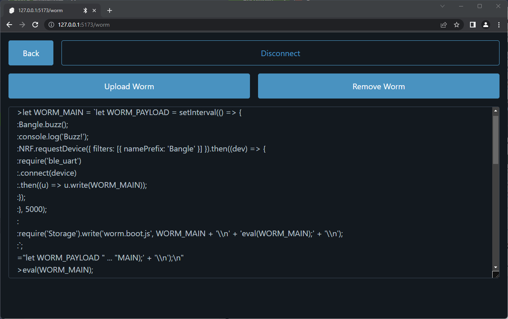
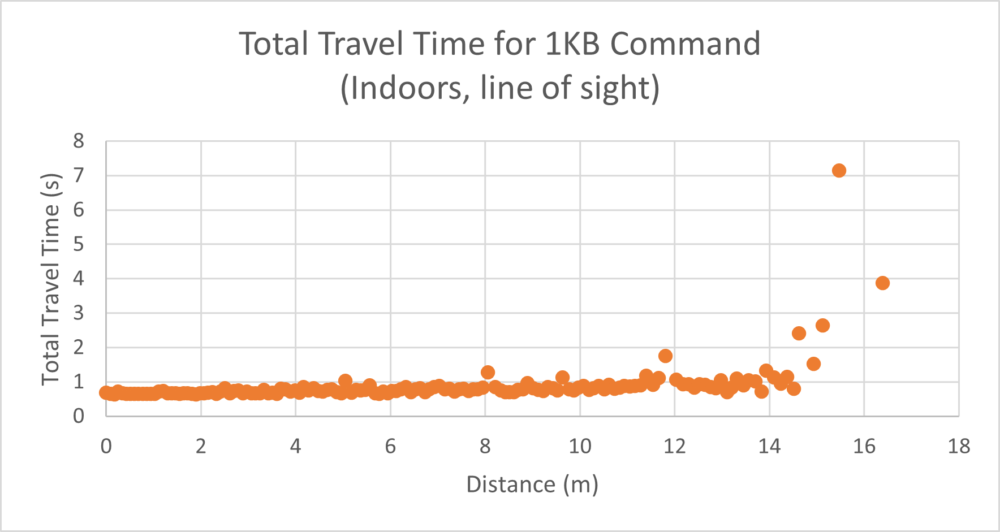
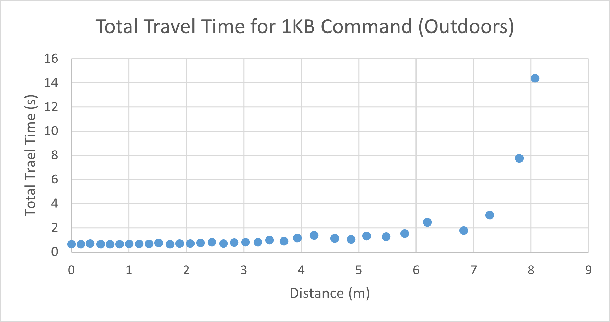

# Finding Security Vulnerabilities in IoT Devices

Faculty Advisor: **Dr. Wei Yang**

Team Lead: **Rishit Viral**

Members: **Samuel Preston, Ben Kye, Naja-Lee Habboush, Daniel Nguyen, and Soumika Seelam**

[View our Project Website](https://acm-research.github.io/IoTSecurityVulnerabilities/)

[View our Research Poster](./static/researchposter.pdf)

# Introduction

As more devices become connected to the internet and integrated with our daily lives, introducing
effective security features becomes an absolute necessity. Many of these devices hold personal
information that can be ruin lives if stolen. Even devices that appear harmless like smart watches
can hold valuable data and are likely connected to a personal phone. That is why we decided to
research a specific watch named the Bangle.js 2, a JavaScript-based smart watch.

# Project Overview

Upon starting the research project, we had to first decide on an IoT device to target. We looked at a variety of devices including smart fridges, doorbells, baby monitors, smart garage door openers, etc. However, there are legal issues that can arise when pen-testing devices that are produced and owned by private companies. Eventually, we decided on the Bangle.js 2, which is described as an “open, hackable smartwatch”. Almost everything related to the watch is open source, which made working with it much easier.
    
After the first meeting with our professor, we were given various resources designed to analyze JavaScript scripts, since every app that runs on the watch is written in JavaScript. Two such resources were Jalangi 2 and Augur. Jalangi is a dynamic analysis framework for JS and allows the user to track various aspects of the script being targeted in order to see what might be vulnerable. Augur is a program that can perform dynamic taint analysis, which tracks data flows through a program and tries to detect possible injection vulnerabilities. Unfortunately, the apps available to Bangle.js are primitive and did not use the runtimes supported by Jalangi and Augur, so no real vulnerabilities were found with these tools.
    
With JavaScript vulnerabilities largely out of the picture, the next logical target would be trying to intercept or somehow exploit the watch's Bluetooth connection. However, since the company that makes Bangle.js is based in Europe, shipping took longer than expected, hindering our ability to analyze any Bluetooth vulnerabilities. Nonetheless, we continued researching the Bluetooth protocol, previously reported Bluetooth CVEs, and pen-testing tools used for Bluetooth/BLE devices. When the watch finally arrived, we instantly realized the watch had the largest security vulnerability that it could've possibly had: it had no security whatsoever. Usually, Bluetooth IoT devices require some sort of two-way handshake authentication (e.g. Airpods require you to hold down a button and then pair them to your phone, Ring doorbells have an app used for setup, etc). However, the watch did not have any of these features. At any point, as long as the watch was not actively connected to another device, you could connect to the watch and gain full access to everything on it. Once connected, we were able to remotely execute any arbitrary code desired, download all of the data stored on the watch, overwrite apps, and even flash the firmware, all without requiring confirmation from the user of the watch. The watch does have a security PIN feature in the Bluetooth settings of the watch, but even on the latest firmware for the watch, enabling it doesn't prevent unauthorized connections and gaining full access.

Eventually, we would use this vulnerability to develop a worm that could spread to other Bangle.js watches. It works by first infecting a watch via a Bluetooth UART serial connection and causing that watch to periodically attempt to do the same to other watches.

The ease of infection and complete lack of security on the Bangle.js 2 is surprising, and users should be cautious while using this device.

# Building an Infection Suite
Because Bangle.js 2 is designed to be controlled by Web Bluetooth (WebBLE), we developed a website in Svelte to test and control the watch. Specifically, the watch's Nordic nRF52840 chip includes a UART Bluetooth serial interface accessible through WebBLE. Once connected, strings of JavaScript code can be sent through this interface that will be automatically executed on the watch. This is because the watch is automatically configured to execute any code sent to this interface and send back the result. Using this feature, we create a web interface that imitated a command line terminal that enabled us to send arbitrary JavaScript code to the watch (Fig 1).

Using the UART Bluetooth system, custom JavaScript scripts can easily be loaded onto the watch as well (Fig 2). As a proof of concept, we developed a worm script that, once uploaded onto a watch, will scan every five seconds for another Bangle.js watch to connect to. Once another watch is found, it will establish a UART Bluetooth connection and transfer its code in the same way it was originally uploaded. Whenever a new watch is infected, it will write itself onto the watch's storage as a boot script so it will persist through restarts. As an example malicious payload, it will also vibrate every time it scans for a new watch.

# Testing Infection Range

In order to effectively infect a target watch, a stable UART Bluetooth connection must be established for enough time to send a payload. We experimented to find the maximum distance 1KB of JavaScript text could be received from.

This experiment included repeatedly sending the watch the 1KB command from a standard phone (Samsung Galaxy Note 9) at increasing distances and recording the time the command started being sent, when it was received by the watch, and when it was received back by the phone. The total time and the distance between the phone and the watch while both indoors and outdoors are below. In both trials, the phone lost connection with the watch immediately after the last recorded packet was received. 
    
The watch was able to reliably receive commands up to fifteen meters when inside, and up to eight meters while outside. Both cases provide a large window to infect a watch since an attacker only needs to be within these distances for less than two seconds.

# Security Vulnerabilities

In the watch’s default state, infection is mostly harmless because the capabilities of the watch with the default apps are very limited. However, if the watch had more apps installed, there could be severe security implications:

* If the 2FA Authenticator app is installed, the app stores cryptographic keys used for authentication on the watch. Therefore, an attacker can easily exfiltrate the keys via the aforementioned major Bluetooth exploit and generate 2FA codes for Google, Amazon, Microsoft, and other services.

* If the watch is connected to a user's phone via the Gadget Bridge app, the watch has access to the user's notifications, text messages, and location. Furthermore, if the user is using the custom version of Gadget Bridge built for Bangle.js, the watch can make HTTP requests through the watch, allowing an attacker easily exfiltrate data to a command-and-control server at any time.

*  There are many apps that a user may rely on to remain safe and healthy such as medication trackers, heart monitors, and medical alert apps. These apps could prove hazardous if they are not working properly, and there is nothing in the operating system that prevents another malicious app from removing or modifying the others.

# Conclusion

During our study, we researched the various ways that Bluetooth Low Energy (BLE) technology interacts with different devices, including the Bangle.js 2. While BLE technology is convenient and widely used, it also has some inherent vulnerabilities that attackers can exploit. 
    
For example, BLE devices usually broadcast their unique identification numbers or "MAC" addresses. These addresses can be used by hackers to track and identify individual devices, which can be a significant privacy concern. BLE devices often transmit sensitive data, such as passwords or credit card information, which can be intercepted by attackers if not encrypted correctly.
    
We examined the potential vulnerabilities present in these technologies, which can pose risks to users' privacy and security. We focused on the Bangle.js 2 and analyzed its apps to identify potential weaknesses in the software. We utilized various techniques such as reverse engineering, code analysis, and penetration testing to expose vulnerabilities in the software.
    
As a result of our findings, we developed software that exploits the Bangle.js technology by enabling individuals to rapidly distribute a program across multiple devices. This software, if used maliciously, can be dangerous as it could be used to steal personal information from unsuspecting users transmitted over BLE.
    
However, the software also has the potential to be beneficial for those who need to program mass amounts of devices quickly. For instance, manufacturers and developers can use it to release updates or software to a large number of devices simultaneously.
    
It is crucial to note that using this software for nefarious purposes is illegal and unethical. We strongly recommend that individuals only use it in a legitimate manner and take appropriate measures to protect the security and privacy of users' personal information.

# References

Bedi, V. (2018). The practical guide to hacking bluetooth low energy. 30(4):1–30.

Espruino (2023). Bangle apps. Bangle Apps Github Respository, 10(5):1–20.

Polop, C. (2023). Pentesting ble - bluetooth low energy. Hack Tricks, 4(4):1–4.

Qingchuan Zhao, Chaoshun Zuo, J. B. and Lin, Z. (2022). Comprehensive vulnerability analysis of mobile app-defined bluetooth peripherals.
Proceedings of the 2022 ACM Asia Conference on Computer and Communications Security, 20(2):1–20.

Rezwana Karim, K. S. (2018). Platform-independent dynamic taint analysis for javascript. IEEE Transactions on Software Engineering, 2(3):1–2.
Technology, B. (2023). Bluetooth wireless technology. Learn About Bluetooth, 10(1):1–5

Technology, B. (2023). Bluetooth wireless technology. Learn About Bluetooth, 10(1):1–5.
